# 活動報名後台　使用手冊

適用版本：0.2 以後　｜　文件日期：2026-10-05

這份手冊給處理報名的行政人員，逐一說明每個畫面、每個按鈕與欄位。安裝程式、Google 登入設定與試算表準備由維護人員負責，請見另一份《部署手冊》。

程式左下角的「使用手冊（F1）」可開啟內建說明視窗，不需要網路或 PDF 閱讀器。視窗左側可選章節或搜尋內容，右側顯示操作步驟與截圖。在主畫面按 F1，或按功能附近的「操作說明」，可直接查看相關章節；開啟說明不會捨棄尚未儲存的變更。說明視窗可按 Esc 關閉，Ctrl+F 跳到手冊搜尋框。

截圖中的紅色框與編號，對應圖片下方表格的同一個編號。截圖使用測試試算表與虛構資料（「測試甲」「名額19」等），Google 帳號、試算表 ID 與 OAuth 檔案路徑已遮蔽。

---

## 目錄

1. 安裝與第一次開啟
2. 程式更新
3. 畫面總覽
4. 待處理與全部名單
5. 報名詳細頁
6. 審核一筆報名（逐步）
7. 付款核帳
8. 發票、修正報名者資料與修改紀錄
9. 處理問題與疑似重複
10. 儲存、取消與離開
11. 更新名單與畫面下方的提示
12. 匯出
13. 設定
14. 鍵盤快速鍵
15. 問題排除

---

## 1. 安裝與第一次開啟

1. 執行維護人員提供的安裝程式（`RegistrationAdminApp-win-Setup.exe`），或從[最新版安裝程式](https://github.com/lemongrasses/RegistrationAdmin-releases/releases/latest/download/RegistrationAdminApp-win-Setup.exe)下載。
   - 若出現「Windows 已保護您的電腦」：按「其他資訊 → 仍要執行」。
2. 安裝不需要任何操作，也不需要系統管理員權限。完成後程式會自動開啟，桌面與開始功能表會有「活動報名後台」捷徑。

開啟程式時會先確認保存的 Google 授權；仍有效時直接進入後台並連線已設定的試算表，不必再按登入。未登入、授權失效或確認失敗時才顯示登入封面。尚未登入時無法查看名單、匯出或設定試算表；使用手冊仍可離線閱讀。

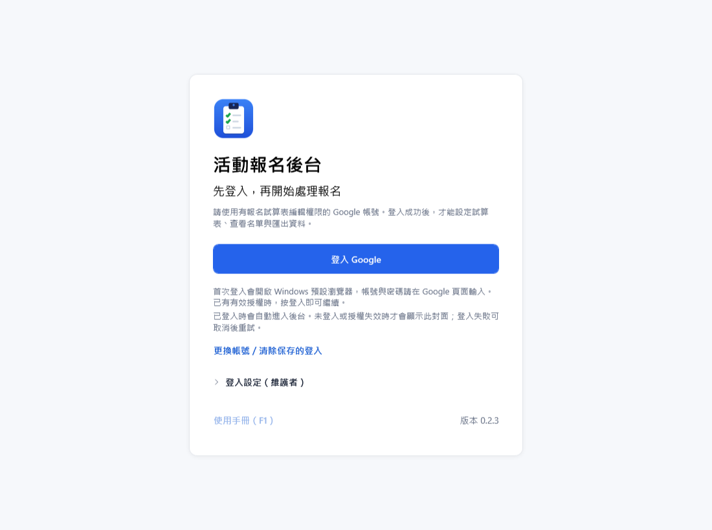

| 編號 | 項目 | 說明 |
|---|---|---|
| 1 | 登入 Google | 使用有試算表編輯權限的 Google 帳號。首次登入會開啟瀏覽器；已有有效授權時可直接繼續，程式會向 Google 確認授權有效。 |
| 2 | 取消登入 | 等候瀏覽器時可取消，取消或失敗後可立即重試。 |
| 3 | 更換帳號／清除保存的登入 | 清除這台電腦的授權，再按「登入 Google」選擇其他帳號。 |
| 4 | 登入設定（維護者） | 登入 JSON 檔缺漏時，可選擇維護人員提供的檔案。 |
| 5 | 使用手冊（F1） | 未登入也能閱讀與搜尋說明。 |

Google 帳號與密碼只在 Google 的登入網頁輸入，程式本身不收取 Google 密碼。目前沒有獨立的程式帳密登入。有效授權會自動恢復登入並跳過封面；啟動檢查不會自行開啟瀏覽器。網路確認失敗時可在封面按「登入 Google」重試，不必清除授權。

登入時的瀏覽器畫面：

程式會使用 **Windows 設定的預設瀏覽器** 開啟 Google 登入頁，不一定是您目前正在使用或貼上試算表網址的那個瀏覽器。程式內目前不能指定 Chrome、Edge 或其他瀏覽器，也不能指定瀏覽器的個人設定檔。

若要改用其他瀏覽器，請先到 Windows「設定 → 應用程式 → 預設應用程式」更換預設瀏覽器，再回到封面按「登入 Google」。Windows 11 可選擇想使用的瀏覽器並按「設為預設值」；Windows 10 可在「網頁瀏覽器」選擇。若電腦由組織管理且無法更改，請聯絡資訊人員。

1. 選擇 Google 帳號。
2. 若出現「Google 尚未驗證這個應用程式」，按「進階」→「前往 活動報名後台（不安全）」。這是內部工具未送 Google 審核的正常提示。
3. 勾選允許存取試算表，按「繼續」。看到「已收到驗證碼，可以關閉此視窗」後回到程式。

若顯示的 Google 帳號不是要用的帳號，請在 Google 登入頁選「使用其他帳戶」，登入有試算表編輯權限的帳號。瀏覽器已登入的帳號不代表一定有這份試算表的權限。

若瀏覽器未開啟、登入失敗或已關閉，回到程式按「取消登入」，確認 Windows 預設瀏覽器能正常開啟網頁後，再按「登入 Google」重試，不需等待逾時或重開程式。取消後請關閉舊的 Google 登入分頁，改用重試時新開啟的登入頁。若保存的授權失效，可先按「更換帳號／清除保存的登入」再登入。

第一次登入成功後，程式會進入「設定 → 開始使用」。按「選擇試算表…」，在 Windows 預設瀏覽器開啟的 Google 選擇器中，使用與程式相同的 Google 帳號，選擇有編輯權限的表單回應試算表；也可以直接貼上試算表網址（`https://docs.google.com/spreadsheets/d/…/edit…`）。


選擇器僅顯示 Google 試算表；Excel 檔請先轉成 Google 試算表。選取後會自動填入網址與檔名，再按「連線試算表」確認管理分頁，程式才會讀取名單。選取本身不會建立或修改管理分頁。

等待瀏覽器時可按「取消選擇」並立即重試，取消或失敗會保留原本設定。切換到不同的試算表後，舊名單會清除，需重新連線才可處理與匯出新名單。若選擇器無法使用，可貼網址繼續設定，再請維護人員確認 Google Picker API 與 Google Drive API 已啟用。

連線成功後會切到「待處理」頁。之後開啟程式，有效授權會自動恢復登入並連線已設定的試算表。

> 若程式詢問是否「建立管理資料區」，或「資料保護」顯示欄位對不上，代表試算表還沒準備好，請聯絡維護人員處理。

## 2. 程式更新

- 程式開啟後會在背景檢查並下載新版本，不影響正在進行的工作。
- 下載完成後，左下角版本號下方會出現「新版本 x.y.z 已下載」與「**重新啟動並更新**」按鈕。按下並確認後，程式會關閉、安裝新版、自動重新開啟。
- 不按也沒關係，可以先繼續工作；有尚未儲存的變更時，程式會先提醒。
- 想立刻檢查：按左下角的「檢查更新」。暫時連不到更新來源時只會顯示提示，不影響使用。
- 更新後設定、試算表網址與 Google 登入都會保留，不需要重新登入。

## 3. 畫面總覽

程式視窗分成左側選單與右側內容：

- **待處理**（開啟程式的首頁）：需要審核、等待付款確認、資料有錯誤或疑似重複的報名。
- **全部名單**：所有報名，可搜尋、篩選與排序。
- **匯出**：把名單輸出成 Excel 或 CSV。
- **設定**：Google 連線狀態與管理員設定。

在名單上點任何一列，會進入該筆的**報名詳細頁**，處理完按「回到名單」。

儲存成功、失敗或更新中的訊息會浮在畫面下方，不會跳出需要按「確定」的視窗。只有會改變資料或捨棄變更的動作才會跳出確認視窗。

## 4. 待處理與全部名單

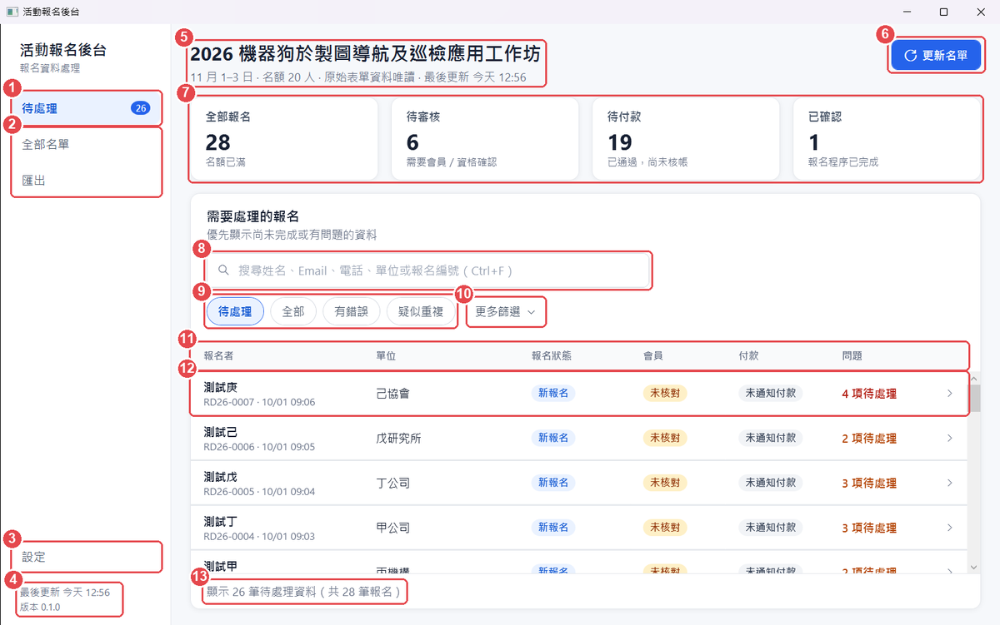

| 編號 | 項目 | 說明 |
|---|---|---|
| 1 | 待處理（左側選單） | 程式首頁。右邊藍色數字是目前需要處理的筆數。 |
| 2 | 全部名單、匯出 | 切換到全部報名，或到匯出頁。 |
| 3 | 設定 | Google 連線與管理員設定。 |
| 4 | 最後更新、版本 | 名單最後一次從 Google 讀取的時間，以及程式版本。 |
| 5 | 活動名稱 | 活動名稱、日期、名額與最後更新時間（取自試算表的 `_Config`）。 |
| 6 | 更新名單（F5） | 從 Google 試算表重新讀取。新的 Google Form 回應會在這時出現，每筆只會建立一次後台資料。 |
| 7 | 摘要卡 | **全部報名**：總筆數與名額狀態（尚有幾個名額／名額已滿）。**待審核**：新報名＋審核中。**待付款**：已通過、尚未核帳。**已確認**：完成報名。視窗高度太小時摘要卡會自動收起。 |
| 8 | 搜尋框（Ctrl+F） | 輸入姓名、Email、電話、單位或報名編號的任一部分，名單即時篩選。 |
| 9 | 快速篩選 | **待處理**／**全部**／**有錯誤**（必填空白、格式錯誤）／**疑似重複**。 |
| 10 | 更多篩選 | 展開進階篩選；有啟用條件時按鈕會顯示「更多篩選（數量）」。 |
| 11 | 欄位標題 | 點標題可依該欄排序，再點一次反向排序。 |
| 12 | 報名列 | 點整列（或用方向鍵選取後按 Enter）開啟詳細頁。第一行是姓名，第二行是報名編號與送出時間。「問題」欄顯示這筆還有幾項待處理；滑鼠停在上面可看到明細。 |
| 13 | 筆數 | 目前顯示幾筆、總共幾筆。 |

**「待處理」包含哪些報名？**

- 新報名或審核中：會員未核對、資格待判定或需補資料、可以完成審核但還沒按。
- 通過待付款：等待付款或已回報匯款待核帳。
- 有錯誤、有未確認的資料問題、疑似重複、報名者修改過原始答案。

**狀態標籤顏色**：藍色＝新報名，黃色＝需要動作（審核中、未核對、待付款），綠色＝完成（已確認、已確認會員、已核帳），灰色＝停止（候補、未通知付款、不通過、已取消）。

### 4.1 更多篩選

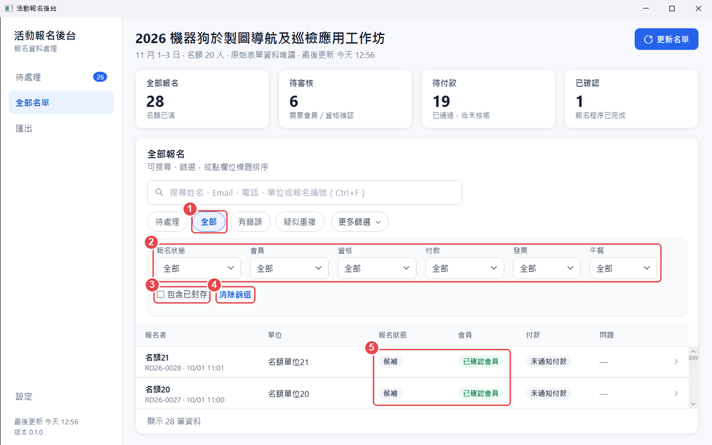

| 編號 | 項目 | 說明 |
|---|---|---|
| 1 | 全部 | 目前選的快速篩選。進階篩選會在這個範圍內再篩。 |
| 2 | 報名狀態、會員、資格、付款、發票、午餐 | 各選一個值；選「全部」表示不限。多個條件同時成立才會顯示。 |
| 3 | 包含已封存 | 預設不顯示已封存的報名；勾選後一起顯示。 |
| 4 | 清除篩選 | 清除搜尋文字與所有進階條件。 |
| 5 | 狀態標籤 | 每列的報名狀態、會員、付款標籤。 |

各下拉選單的選項：

| 篩選 | 選項 |
|---|---|
| 報名狀態 | 新報名、審核中、通過待付款、候補、不通過、已確認、付款逾期、已取消 |
| 會員 | 未核對、已確認會員、非會員、無法核對 |
| 資格 | 未判定、符合資格、不符資格、需補資料 |
| 付款 | 未通知付款、待付款、已回報匯款、已核帳、逾期、付款異常、已退款 |
| 發票 | 待開立、已開立、已作廢 |
| 午餐 | 葷食、素食、不需午餐、其他 |

### 4.2 疑似重複與有錯誤

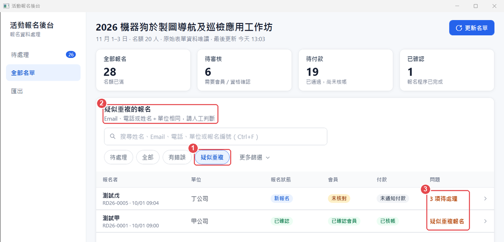

| 編號 | 項目 | 說明 |
|---|---|---|
| 1 | 疑似重複 | 只顯示 Email、電話相同，或姓名＋單位相同的報名。 |
| 2 | 名單標題 | 說明目前看的是哪一種清單與判斷依據。 |
| 3 | 問題欄 | 「疑似重複報名」或「N 項待處理」。打開詳細頁後在「疑似重複的判斷」處理（第 9 節）。 |

「有錯誤」用法相同，列出必填欄位空白或格式錯誤（Email、電話、統編）的報名。

## 5. 報名詳細頁

點名單任一列會打開詳細頁。左邊是**原始報名資料（唯讀）**，右邊是**處理這筆報名**。

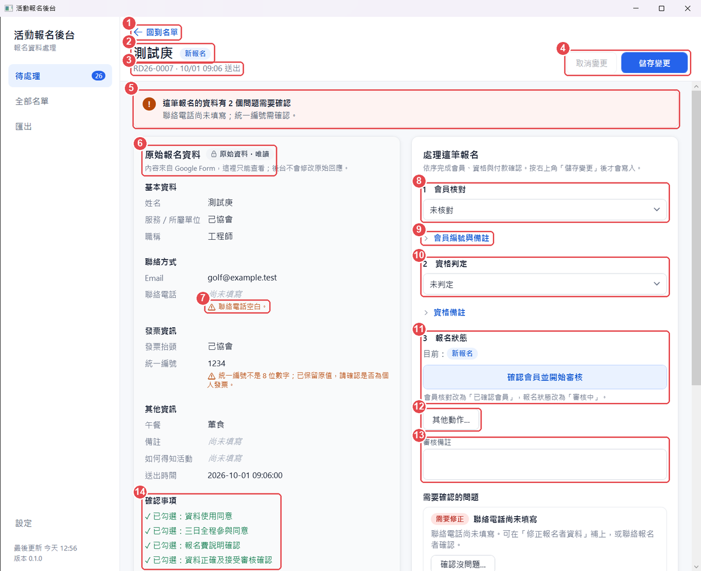

| 編號 | 項目 | 說明 |
|---|---|---|
| 1 | 回到名單（Alt+←） | 回到剛才的名單。有未儲存的變更時會先詢問（第 10 節）。 |
| 2 | 姓名與狀態 | 報名者姓名與目前報名狀態。已封存時多一個「已封存」標籤。 |
| 3 | 報名編號與送出時間 | 例如 RD26-0007。報名編號在第一次讀入時產生，之後不會改變。 |
| 4 | 取消變更／儲存變更（Ctrl+S） | 「儲存變更」把右側所有修改一次寫入 Google 試算表；「取消變更」恢復到上次儲存的內容。沒有變更時「取消變更」是灰色的。 |
| 5 | 問題摘要 | 這筆資料有幾個問題需要確認，以及問題名稱。紅色＝有錯誤，黃色＝只有提醒。 |
| 6 | 原始報名資料・唯讀 | 內容來自 Google Form，可以選取複製但不能修改。後台修正過的欄位會在下方多一行「後台修正為：…」。 |
| 7 | 欄位提示 | 欄位空白或格式有問題時，直接在該欄下方顯示原因。 |
| 8 | 1　會員核對 | 未核對／已確認會員／非會員／無法核對。 |
| 9 | 會員編號與備註 | 展開後可填會員編號或名冊位置、核對備註。 |
| 10 | 2　資格判定 | 未判定／符合資格／不符資格／需補資料；展開「資格備註」可填說明。 |
| 11 | 3　報名狀態與下一步按鈕 | 顯示目前狀態，以及**唯一一個**目前可以做的下一步（藍色大按鈕）。按鈕下方的灰字說明按下後會改變哪些欄位。 |
| 12 | 其他動作… | 不通過、候補、取消、付款逾期、退款、封存等較少用或較重大的動作（第 6.3 節）。 |
| 13 | 審核備註 | 內部的審核紀錄；「不通過」的理由也會寫在這裡。 |
| 14 | 確認事項 | Google Form 上的四項確認（資料使用、三日全程參與、報名費說明、資料正確及接受審核）。綠色＝已勾選，紅色粗體＝未勾選。 |

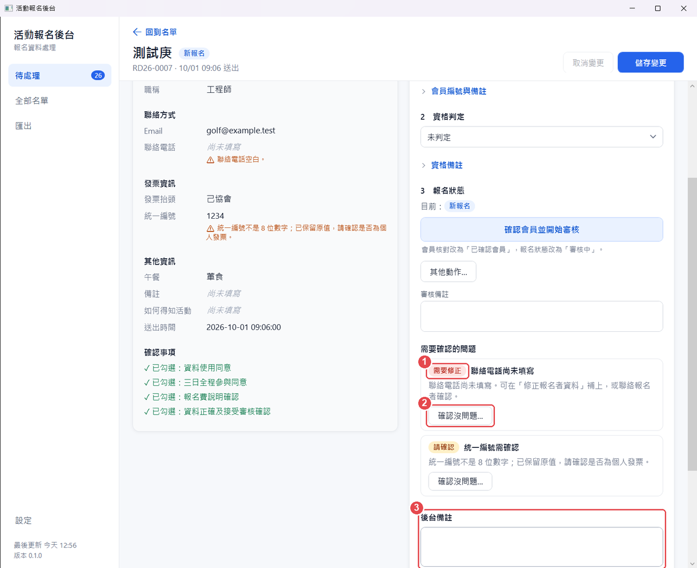

| 編號 | 項目 | 說明 |
|---|---|---|
| 1 | 問題嚴重度 | 「需要修正」（錯誤）或「請確認」（提醒）。 |
| 2 | 確認沒問題… | 記錄原因後，這個問題不再列為待處理（第 9 節）。 |
| 3 | 後台備註 | 只給內部人員看的備註，可隨時填寫。 |

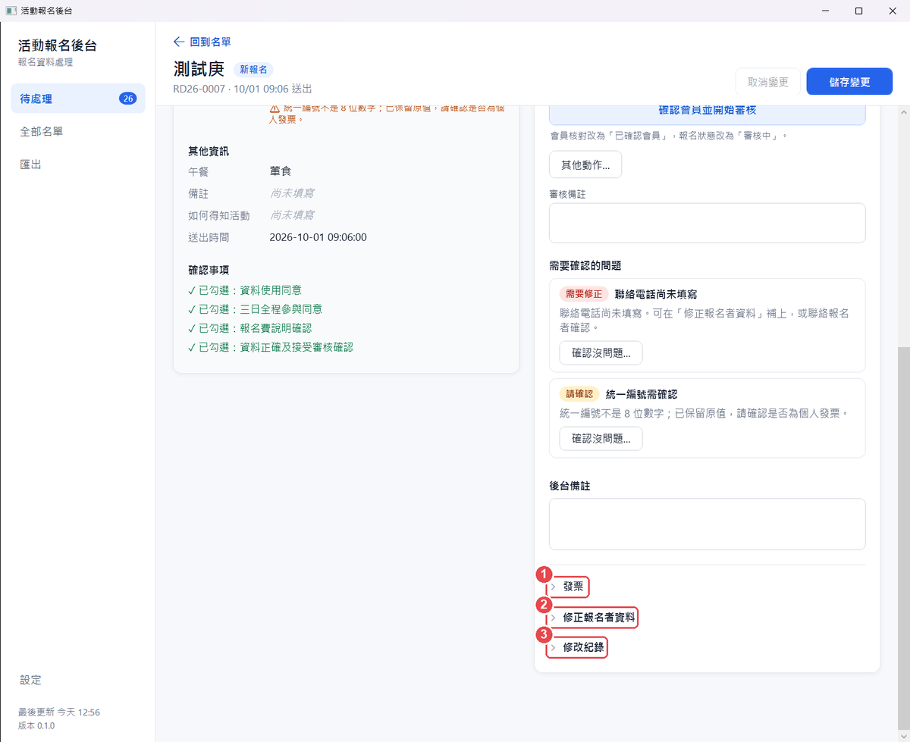

| 編號 | 項目 | 說明 |
|---|---|---|
| 1 | 發票 | 發票狀態、號碼、開立日期與備註（第 8.1 節）。 |
| 2 | 修正報名者資料 | 報名者填錯時填寫正確值，原始答案不變（第 8.2 節）。 |
| 3 | 修改紀錄 | 這筆報名所有後台變更的時間與內容（第 8.3 節）。 |

這三區預設收起，點標題展開。

## 6. 審核一筆報名（逐步）

### 6.1 狀態流程

```
新報名 → 審核中 → 通過待付款 → 已確認
              ├→ 候補 → 通過待付款
              └→ 不通過（需填理由）
通過待付款 → 付款逾期／已取消（需填原因）
候補、已確認 → 已取消（需填原因）
```

- 「通過待付款」與「已確認」占用名額（預設 20 人）。名額滿時只能保持審核中或改為候補。
- 系統**不會**自動改狀態、不會寄信、不會建立金流交易。所有狀態都由人工按按鈕改變。

### 6.2 一般審核流程

**步驟 1：確認會員並開始審核。** 打開一筆「新報名」，核對會員名冊後，按右側藍色大按鈕「確認會員並開始審核」。

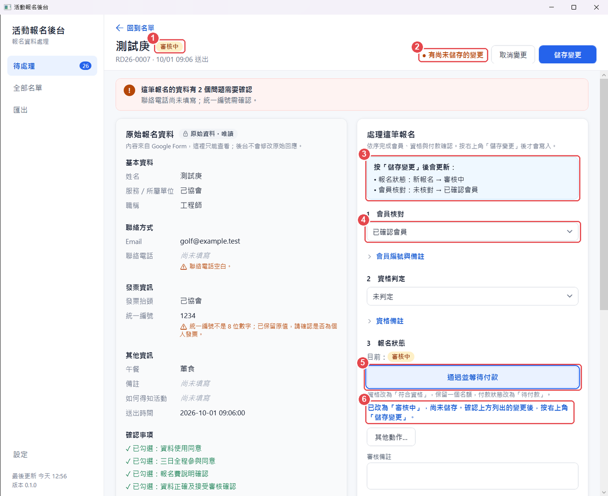

| 編號 | 項目 | 說明 |
|---|---|---|
| 1 | 狀態標籤 | 已經改為「審核中」，但**還沒寫入**。 |
| 2 | 有尚未儲存的變更 | 提醒這筆有修改還沒儲存。 |
| 3 | 按「儲存變更」後會更新 | 逐項列出儲存後會改變的欄位（舊值 → 新值）。請先看過再儲存。 |
| 4 | 會員核對 | 按鈕已自動改成「已確認會員」。若實際不是會員，可在這裡改回。 |
| 5 | 下一步按鈕 | 換成下一個步驟「通過並等待付款」。 |
| 6 | 動作說明 | 藍色粗體字說明剛才做了什麼、還沒儲存。 |

**步驟 2：通過並等待付款。** 確認資格後按「通過並等待付款」。這個按鈕會把資格設為「符合資格」、占用一個名額，並把付款狀態改為「待付款」。

按鈕只在下列條件都成立時才會生效：

- 會員為「已確認會員」，資格為「符合資格」（按鈕會把「未核對／未判定」一併設好）。
- 四項確認都有勾選。
- 姓名、單位、職稱、Email、電話、發票抬頭、統編、午餐不缺。
- 名額未滿。

條件不符時，按鈕**不會改變任何資料**，並在右側上方列出原因：

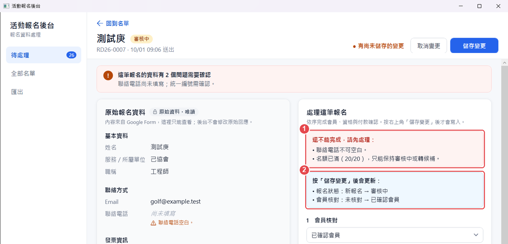

| 編號 | 項目 | 說明 |
|---|---|---|
| 1 | 還不能完成，請先處理 | 列出不能完成的原因。此例：電話空白、名額已滿（20/20）。處理完再按一次即可。 |
| 2 | 按「儲存變更」後會更新 | 前一步（開始審核）的變更仍保留，可以先儲存。 |

**步驟 3：儲存。** 按右上角「儲存變更」（Ctrl+S）。畫面下方出現「已儲存『姓名』的變更」即完成。

> 小技巧：可以連續按兩個步驟再一次儲存，「按儲存變更後會更新」會列出全部變更。

### 6.3 其他動作

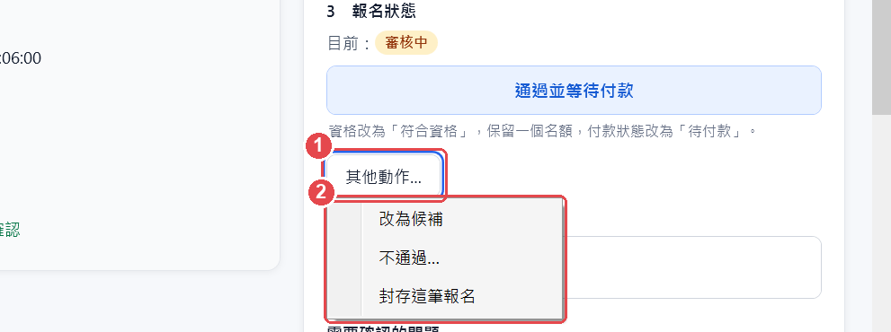

| 編號 | 項目 | 說明 |
|---|---|---|
| 1 | 其他動作… | 點一下打開選單。滑鼠停在按鈕上會顯示所有可能的動作。 |
| 2 | 動作清單 | 只列出目前狀態可以做的動作。 |

| 動作 | 何時出現 | 效果 |
|---|---|---|
| 不通過… | 新報名、審核中 | 狀態改為「不通過」。**必須填理由**，理由寫入審核備註。 |
| 改為候補 | 審核中 | 狀態改為「候補」，自動排入下一個候補順位。 |
| 標記付款逾期 | 通過待付款 | 狀態改為「付款逾期」並釋出名額。不會通知報名者。 |
| 取消報名… | 通過待付款、候補、已確認 | 狀態改為「已取消」並釋出名額。**必須填取消原因**。 |
| 標記為已退款 | 已確認或已取消，且已核帳 | 付款狀態改為「已退款」。系統不會實際退款，請先完成退款再標記。 |
| 封存這筆報名／取消封存 | 任何狀態 | 封存後預設名單不再顯示，資料不會刪除，可隨時取消封存。 |

選擇動作後會跳出確認視窗。需要理由的動作，理由欄空白時確認按鈕無法按：

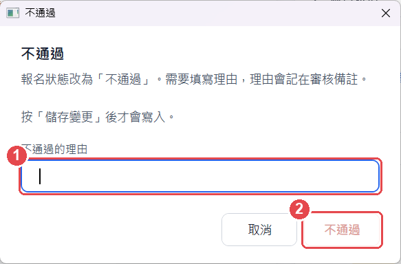

| 編號 | 項目 | 說明 |
|---|---|---|
| 1 | 理由 | 填寫不通過的理由（會記在審核備註）。 |
| 2 | 確認按鈕 | 填了理由才能按。按下後一樣要再按「儲存變更」才會寫入。 |

候補報名之後要錄取時，打開該筆按「從候補改為通過並等待付款」。

## 7. 付款核帳

狀態為「通過待付款」的報名，右側會多出「4　付款」區。

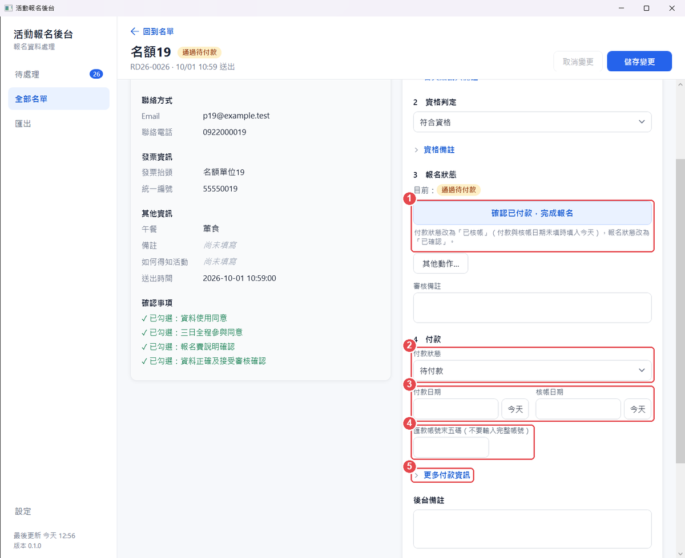

| 編號 | 項目 | 說明 |
|---|---|---|
| 1 | 確認已付款，完成報名 | 一鍵完成：付款狀態改為「已核帳」，付款日期與核帳日期空白時填入今天，報名狀態改為「已確認」。 |
| 2 | 付款狀態 | 未通知付款、待付款、已回報匯款、已核帳、逾期、付款異常、已退款。 |
| 3 | 付款日期、核帳日期 | 格式 `2026-10-15`；按「今天」直接填入今天日期。 |
| 4 | 匯款帳號末五碼 | **只填末五碼**，不要輸入完整帳號（最多 5 個字元）。 |
| 5 | 更多付款資訊 | 展開更多欄位（下圖）。 |

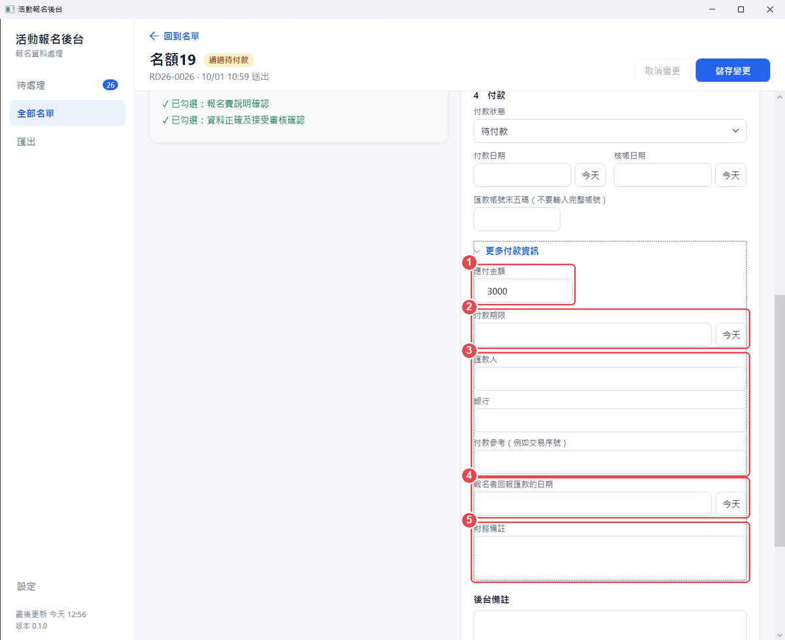

| 編號 | 項目 | 說明 |
|---|---|---|
| 1 | 應付金額 | 這筆應繳的金額（本活動報名費為 3000），必須是數字。 |
| 2 | 付款期限 | 通知繳費時約定的期限。 |
| 3 | 匯款人、銀行、付款參考 | 對帳用；付款參考可填交易序號。 |
| 4 | 報名者回報匯款的日期 | 報名者通知已匯款的日期。 |
| 5 | 財務備註 | 對帳時的內部說明。 |

按下「確認已付款，完成報名」後：

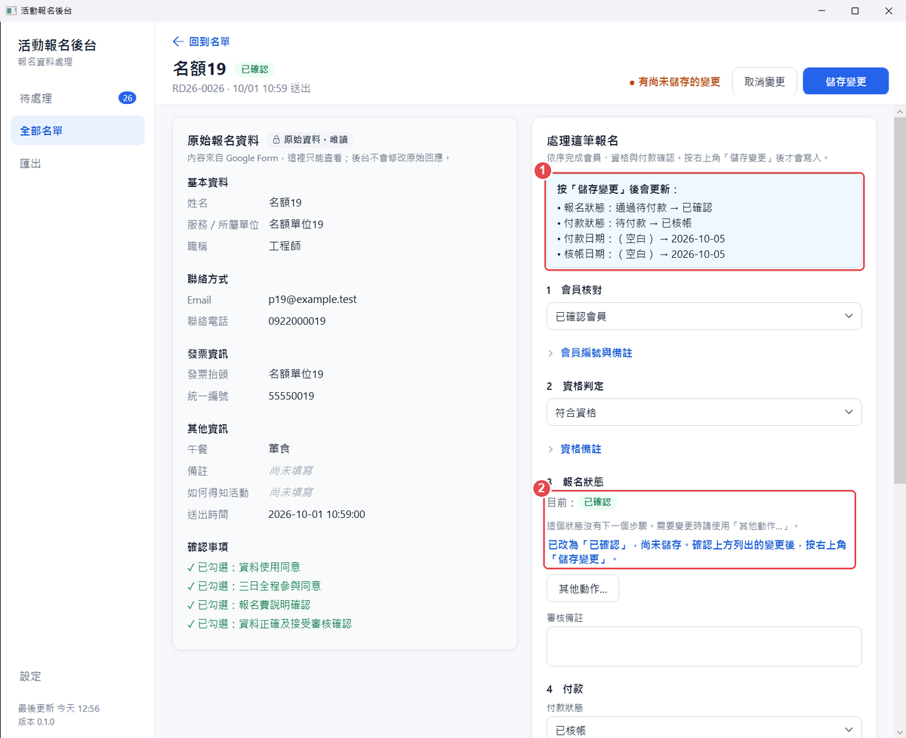

| 編號 | 項目 | 說明 |
|---|---|---|
| 1 | 將更新的內容 | 報名狀態、付款狀態、付款日期、核帳日期四項變更。確認無誤後按「儲存變更」。 |
| 2 | 已確認 | 已確認是流程終點，沒有下一個步驟；需要取消或退款時用「其他動作…」。 |

也可以不按大按鈕，直接在付款欄位逐欄填寫再儲存（例如先記錄「已回報匯款」，等對帳完成再確認）。

## 8. 發票、修正報名者資料與修改紀錄

### 8.1 發票

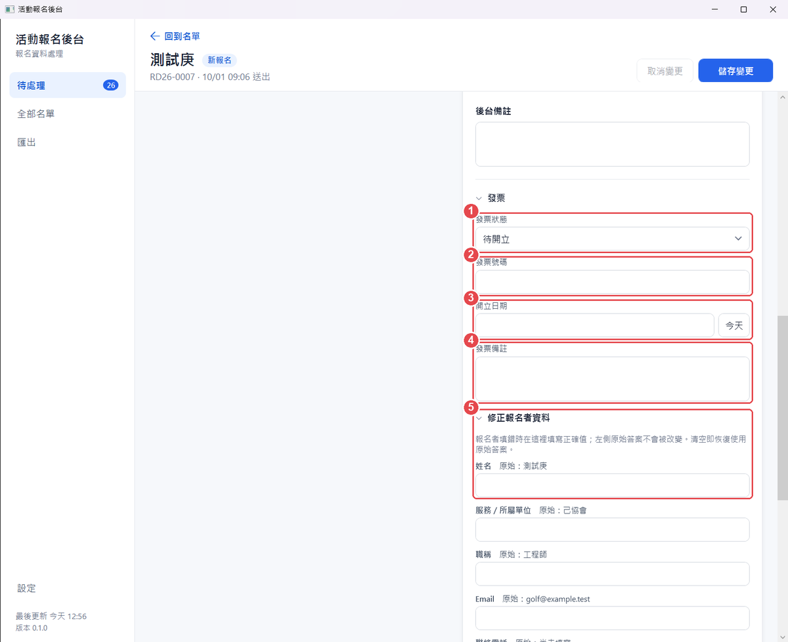

| 編號 | 項目 | 說明 |
|---|---|---|
| 1 | 發票狀態 | 待開立、已開立、已作廢。 |
| 2 | 發票號碼 | 開立後填入；以文字保存，開頭的 0 不會消失。 |
| 3 | 開立日期 | 按「今天」可直接填入。 |
| 4 | 發票備註 | 內部說明。 |
| 5 | 修正報名者資料 | 見下一節。 |

發票抬頭與統一編號來自報名表；統編不是 8 位數字時，會在原始資料下方提示「已保留原值，請確認是否為個人發票」。

### 8.2 修正報名者資料

報名者填錯字、漏填時，在這裡填寫正確值。**原始答案永遠不會被改變**，畫面與匯出會改用修正值；把修正欄清空即恢復使用原始答案。

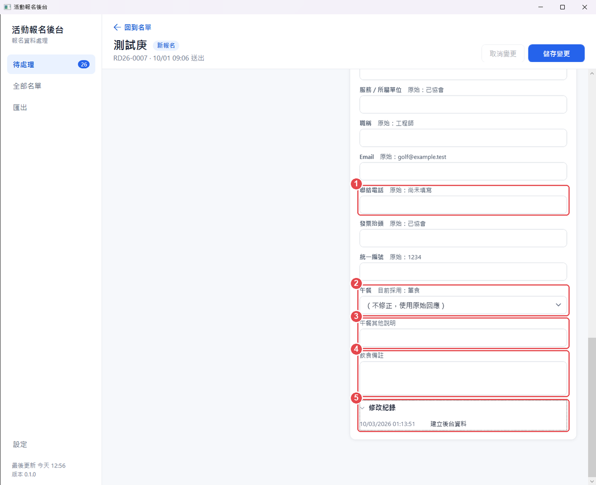

| 編號 | 項目 | 說明 |
|---|---|---|
| 1 | 欄位修正 | 每個可修正的欄位上方都顯示「原始：…」。此例聯絡電話原本未填，可在這裡補上。可修正：姓名、單位、職稱、Email、聯絡電話、發票抬頭、統一編號。 |
| 2 | 午餐 | 「（不修正，使用原始回應）」或改為葷食、素食、不需午餐、其他。上方顯示目前採用的值。 |
| 3 | 午餐其他說明 | 午餐選「其他」時必填。 |
| 4 | 飲食備註 | 過敏、禁忌等說明。 |
| 5 | 修改紀錄 | 見下一節。 |

### 8.3 修改紀錄

展開後列出這筆報名每一次後台變更的時間與內容（例如「建立後台資料」、狀態與欄位變更），資料來自試算表的 `_ChangeLog` 分頁。紀錄只能查看，不能修改。

## 9. 處理問題與疑似重複

程式會自動檢查每筆報名，發現問題時列在詳細頁的「需要確認的問題」：

| 問題 | 嚴重度 | 處理方式 |
|---|---|---|
| ○○尚未填寫 | 需要修正 | 在「修正報名者資料」補上，或聯絡報名者確認。 |
| 未勾選「○○」 | 需要修正 | 聯絡報名者；四項確認未勾選時無法通過審核。 |
| Email 格式需確認、電話不完整、統一編號需確認 | 請確認 | 修正，或確認沒問題。 |
| 午餐「其他」未說明 | 請確認 | 在「午餐其他說明」補上。 |
| 疑似重複報名 | 請確認 | 在「疑似重複的判斷」判斷（見下方）。 |
| 報名者修改過原始答案 | 請確認 | 報名者在 Google Form 改了答案。看過左側最新內容後按「我已確認最新內容」。 |
| 找不到原始報名資料 | 錯誤 | 原始回應可能被刪除或修改。後台資料會保留；請管理員到「設定 → 進階」處理對應。 |

**確認沒問題**：資料其實正確時（例如報名者確實沒有統編、已電話確認），按問題卡片上的「確認沒問題…」，填寫原因後按「確認並記錄」。這個動作會**立即記錄**，不需要再按儲存；之後這個問題不再列為待處理。

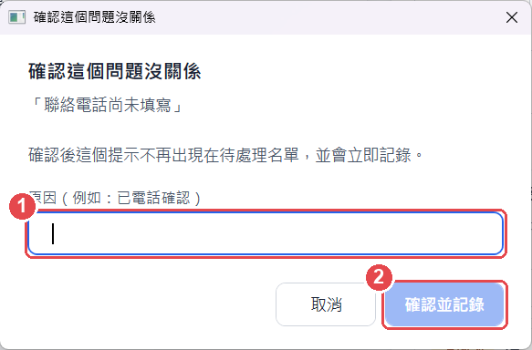

| 編號 | 項目 | 說明 |
|---|---|---|
| 1 | 原因 | 例如「已電話確認」。必填。 |
| 2 | 確認並記錄 | 填了原因才能按，按下後立即寫入試算表。 |

> 這筆報名有尚未儲存的變更時，不能確認問題；畫面下方會提示「請先儲存或取消目前的變更，再確認這個問題」。

**疑似重複的判斷**：有疑似重複時，詳細頁會出現這一區。

- 「重複判定」選「確認非重複」：兩筆是不同人，提示消失。
- 選「重複（保留另一筆）」：再在「保留的另一筆報名」選要保留的那一筆。系統**不會自動合併或刪除**；確定重複的那一筆通常再用「其他動作 → 取消報名」或「封存」處理。

## 10. 儲存、取消與離開

- **儲存變更（Ctrl+S）**：把這筆所有修改一次寫入試算表。欄位有錯誤時不會寫入，並顯示「還有 N 個地方需要修正才能儲存」。
- **取消變更**：恢復到上次儲存的內容，會先確認：

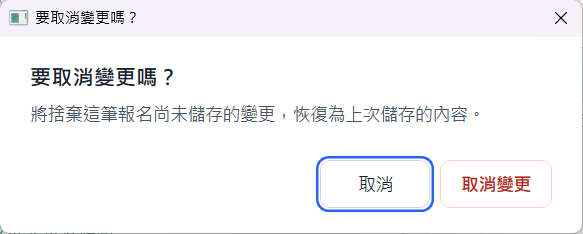

- **有未儲存的變更時離開**（回到名單、切換頁面、更新名單、關閉程式）：

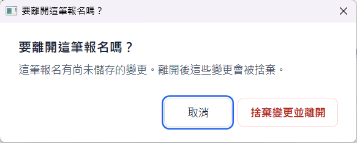

按「取消」留在這筆繼續編輯；按「捨棄變更並離開」放棄修改。

**同一時間只由一位主要管理者修改。** 若兩台電腦同時修改同一筆，後儲存的會看到「資料已在其他地方更新，請先按『更新名單』重新整理」。照做後再修改；程式不會覆寫別人的修改。

**網路中斷時**：儲存會失敗，輸入內容保留在畫面上；恢復網路後再按一次「儲存變更」。

## 11. 更新名單與畫面下方的提示

按「更新名單」（F5）時，按鈕變灰、畫面下方顯示進度：

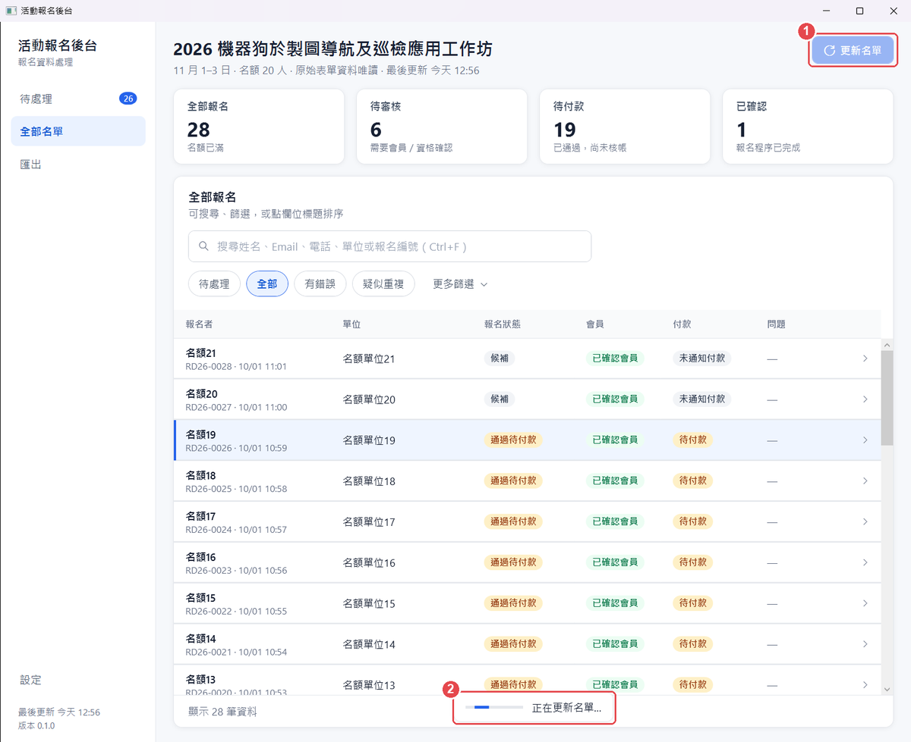

| 編號 | 項目 | 說明 |
|---|---|---|
| 1 | 更新名單（處理中） | 處理中暫時無法再按。 |
| 2 | 進度提示 | 「正在更新名單…」，完成後換成結果訊息。 |

結果訊息的四種顏色：

| 顏色 | 範例 | 意義 |
|---|---|---|
| 綠色 ✓ | 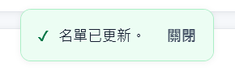 | 成功（名單已更新、已儲存）。數秒後自動消失。 |
| 藍色 i |  | 一般資訊（已取消變更）。 |
| 黃色 ! | 「請先儲存或取消目前的變更…」 | 需要您先做某件事。 |
| 紅色 ! | 「儲存失敗，您輸入的內容仍保留在畫面上。」 | 操作失敗，請依訊息處理。 |

按訊息右邊的「關閉」可立即關掉。

## 12. 匯出

左側「匯出」。匯出檔包含個人資料，請妥善保存，用完即刪。

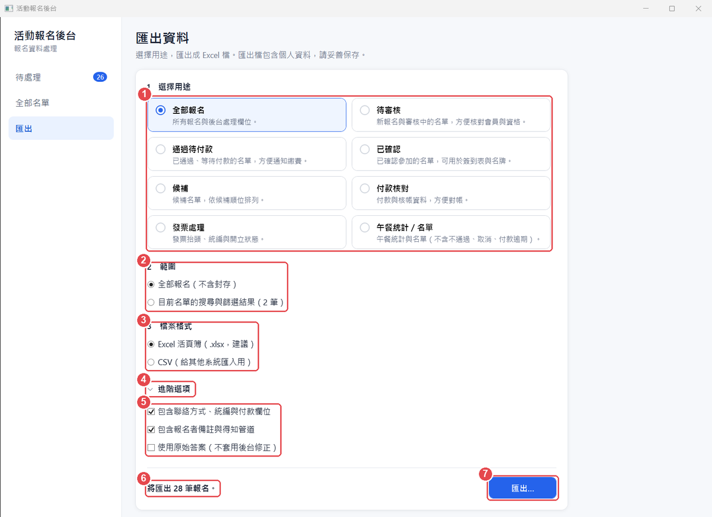

| 編號 | 項目 | 說明 |
|---|---|---|
| 1 | 選擇用途 | 八種範本，各自決定匯出哪些報名與哪些欄位（見下表）。 |
| 2 | 範圍 | **全部報名（不含封存）**，或**目前名單的搜尋與篩選結果**（先在名單頁篩好再來匯出）。 |
| 3 | 檔案格式 | Excel 活頁簿（.xlsx，建議）或 CSV（給其他系統匯入用，UTF-8 編碼，Excel 可直接開啟）。 |
| 4 | 進階選項 | 點開後有三個勾選項。 |
| 5 | 進階勾選項 | **包含聯絡方式、統編與付款欄位**：取消勾選會移除 Email、電話、統編、匯款資訊等敏感欄位。**包含報名者備註與得知管道**。**使用原始答案（不套用後台修正）**。 |
| 6 | 將匯出 N 筆 | 依目前選擇計算的筆數；沒有符合的報名時會顯示「目前沒有符合這個範本的報名」。 |
| 7 | 匯出… | 選擇存檔位置後輸出。完成後可按「開啟檔案位置」。 |

| 範本 | 包含的報名 | 主要欄位 |
|---|---|---|
| 全部報名 | 全部 | 所有報名與後台處理欄位、未處理問題 |
| 待審核 | 新報名、審核中 | 基本資料、會員、資格、審核備註、問題 |
| 通過待付款 | 通過待付款 | 聯絡方式、應付金額、付款期限、發票抬頭、統編（方便通知繳費） |
| 已確認 | 已確認 | 姓名、單位、職稱、聯絡方式、午餐（可做簽到表與名牌） |
| 候補 | 候補（依候補順位排序） | 候補順位、聯絡方式、審核備註 |
| 付款核對 | 通過待付款、已確認、付款逾期 | 應付金額、付款狀態、匯款人、銀行、末五碼、付款／核帳日期 |
| 發票處理 | 通過待付款、已確認 | 發票抬頭、統編、發票狀態、號碼、開立日 |
| 午餐統計／名單 | 排除不通過、已取消、付款逾期 | 午餐、其他說明、飲食備註，另附午餐統計 |

Excel 中統編、電話、帳號末五碼、發票號碼都以文字保存，開頭的 0 不會消失。檔案正在 Excel 中開啟時無法覆寫，請先關閉。

## 13. 設定

一般使用者通常只需要看「Google 連線」是否為「已連線」。

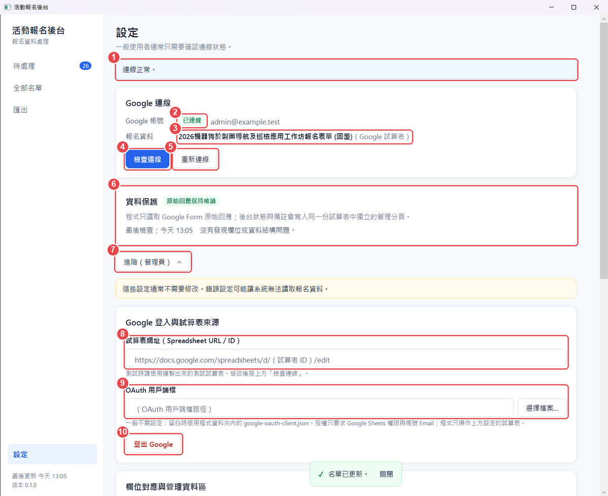

| 編號 | 項目 | 說明 |
|---|---|---|
| 1 | 狀態訊息 | 最近一次連線檢查的結果，例如「連線正常。」。 |
| 2 | Google 帳號 | 「已連線」與目前登入的 Email；「未連線」時請按「檢查連線」。 |
| 3 | 報名資料 | 目前連線的試算表名稱。 |
| 4 | 檢查連線 | 重新讀取試算表、檢查欄位並更新名單。 |
| 5 | 重新連線 | 重新登入 Google，可以換成其他帳號。 |
| 6 | 資料保護 | 確認原始回應保持唯讀，並顯示最後一次欄位檢查結果。欄位對不上時文字會變成黃色。 |
| 7 | 進階（管理員） | 展開管理員設定（下方）。**一般使用者不需要修改這些設定**，錯誤設定可能讓系統無法讀取報名資料；除了「建立診斷資料…」之外，請在維護人員指示下操作。 |
| 8 | 試算表網址 | 要換試算表時在這裡貼新網址，再按「檢查連線」。測試時請使用複製出來的測試試算表。 |
| 9 | OAuth 用戶端檔 | 留白時使用程式資料夾內的 `google-oauth-client.json`。需要臨時改用其他用戶端檔時按「選擇檔案…」。 |
| 10 | 登出 Google | 刪除本機保存的登入授權、清除記憶體中的名單，返回登入封面。 |

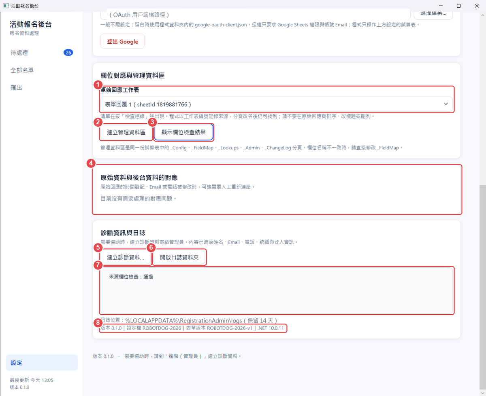

| 編號 | 項目 | 說明 |
|---|---|---|
| 1 | 原始回應工作表 | Google Form 的回應分頁（按「檢查連線」後出現清單）。程式以工作表編號（sheetId）記錄，分頁改名仍可找到。 |
| 2 | 建立管理資料區 | 建立或補齊 `_Config`、`_FieldMap`、`_Lookups`、`_Admin`、`_ChangeLog` 分頁；已存在時只在最後補上缺少的欄位。不會修改原始回應。 |
| 3 | 顯示欄位檢查結果 | 在下方結果框列出欄位檢查結果；缺少欄位時會列出哪些。 |
| 4 | 原始資料與後台資料的對應 | 原始回應的時間戳記、Email 或電話被改過時，程式不會自動猜測，而是列在這裡：左邊選「尚未連結的原始回應」，右邊選「可能對應的後台資料」，按「重新連結」。沒有問題時顯示「目前沒有需要處理的對應問題」。 |
| 5 | 建立診斷資料… | 產生一個 zip 交給維護人員。內容不含登入資訊、試算表 ID 或報名資料，日誌已遮蔽姓名、Email、電話、統編。 |
| 6 | 開啟日誌資料夾 | 在檔案總管打開日誌資料夾（日誌保留 14 天）。 |
| 7 | 結果框 | 顯示欄位檢查或診斷結果，例如「來源欄位檢查：通過」。 |
| 8 | 版本資訊 | 程式版本、設定檔、表單版本與 .NET 版本，回報問題時請一併提供。 |

## 14. 鍵盤快速鍵

| 按鍵 | 功能 |
|---|---|
| F1 | 開啟目前頁面的操作說明 |
| F5 | 更新名單 |
| Ctrl+F | 跳到搜尋框 |
| ↑ ↓ ＋ Enter | 在名單中選取並開啟報名 |
| Ctrl+S | 儲存變更（詳細頁） |
| Alt+← | 回到名單（詳細頁） |
| Tab／Shift+Tab | 在欄位之間移動 |
| Esc | 關閉確認視窗（等同按「取消」） |

## 15. 問題排除

| 訊息或狀況 | 處理 |
|---|---|
| 找不到 Google 登入設定檔 | 重新執行一次最新的安裝程式；仍不行時請聯絡維護人員。 |
| Google 尚未驗證這個應用程式 | 正常提示。按「進階 → 前往（不安全）」。 |
| 每 7 天要重新登入 | Google 端的登入設定還在測試狀態，請聯絡維護人員。 |
| 目前登入的 Google 帳號沒有這份試算表的編輯權限 | 請試算表擁有者分享「編輯者」權限，或按「重新連線」改用有權限的帳號。 |
| 找不到這份試算表 | 網址錯誤或檔案已刪除。到「設定 → 進階（管理員）」修正網址。 |
| 報名表的欄位和系統設定對不上 | 報名表的題目被修改過，請聯絡維護人員。在修正前名單不會更新，但已輸入的後台資料不受影響。 |
| 管理分頁缺少欄位 | 請聯絡維護人員。 |
| 資料已在其他地方更新 | 有人同時修改。按「更新名單」後重新修改。 |
| Google 目前太忙碌 | 程式已自動等待並重試約 90 秒仍失敗。稍候 1 分鐘再按一次儲存；輸入內容仍保留在畫面上。連續審核很多筆時較容易遇到（Google 每分鐘寫入次數有上限）。 |
| 儲存失敗（網路） | 檢查網路，恢復後再按「儲存變更」。 |
| 原始資料與後台資料的對應有問題 | 請聯絡維護人員。 |
| 無法寫入檔案 | 匯出的檔案正在 Excel 中開啟，請關閉後再匯出；或選擇有寫入權限的資料夾。 |
| Windows 已保護您的電腦（SmartScreen） | 安裝程式尚未簽章。按「其他資訊 → 仍要執行」。 |
| 需要回報問題 | 「設定 → 進階（管理員）→ 建立診斷資料…」，把 zip 交給維護人員。 |

