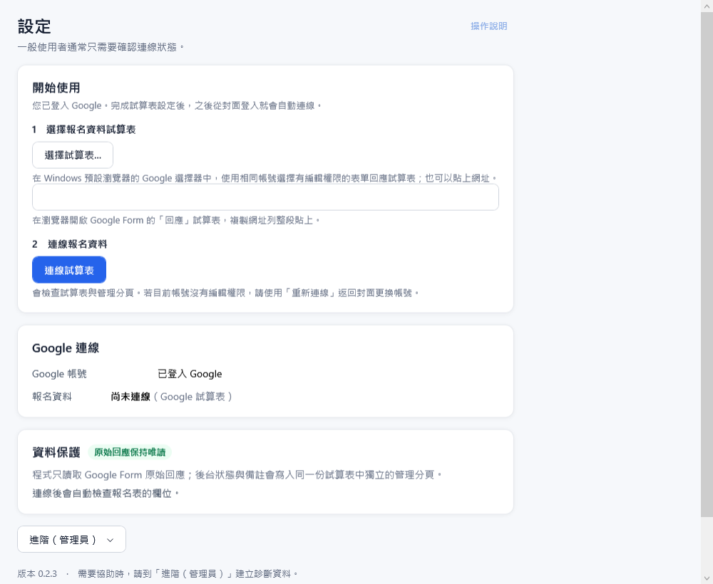

# 活動報名後台　部署手冊

適用版本：0.2 以後　｜　文件日期：2026-10-05

這份手冊給維護人員：準備 Google 登入設定與報名試算表、建置並發佈安裝程式、協助使用者第一次連線，以及日後的更新與維護。各畫面與功能的操作方式請見《使用手冊》（`docs\manual\使用手冊.md`，安裝程式內附 PDF）。

---

## 目錄

1. 系統概覽
2. 需求與角色
3. 準備 Google 登入設定（OAuth 用戶端，整個組織只做一次）
4. 準備報名試算表
5. 建置安裝程式
6. 安裝到使用者電腦
7. 第一次執行與連線
8. 發佈更新、解除安裝與換電腦
9. 維護人員的問題排除
10. 附錄：試算表中的管理分頁、本機檔案

---

## 1. 系統概覽

RegistrationAdmin 是一個 Windows 桌面程式，用來處理 Google Form 的報名資料：

```
報名者 ──填寫──▶ Google Form ──自動寫入──▶ 回應試算表（原始回應頁）
                                               │  只讀
                                               ▼
                                     RegistrationAdmin（Windows）
                                               │  只寫入管理分頁
                                               ▼
                       同一份試算表的 _Config／_FieldMap／_Lookups／_Admin／_ChangeLog
```

重要原則：

- **原始回應頁只讀不寫。** 程式不會排序、修改或刪除 Google Form 的回應。審核狀態、付款、備註與修正值都寫在同一份試算表中另外建立的管理分頁。
- **本機不保存名單。** 名單只在程式執行時存在記憶體中，資料都在 Google 試算表。本機只保存設定、加密的登入授權與遮蔽個資後的日誌。
- **沒有程式自己的帳號或權限頁。** 誰能看、誰能改，完全由 Google 帳號與試算表的「共用」設定決定。

## 2. 需求與角色

| 項目 | 需求 |
|---|---|
| 作業系統 | Windows 10 22H2 或 Windows 11（64 位元） |
| 網路 | 可連到 Google（accounts.google.com、sheets.googleapis.com） |
| 執行環境 | 不需另外安裝 .NET；發佈的 exe 已內含 |
| 螢幕 | 建議 1366×768 以上；125% 縮放可正常使用 |
| Google 帳號 | 對回應試算表有「編輯者」權限 |

| 角色 | 要做的事 |
|---|---|
| 維護人員（只做一次） | 建立 Google Cloud OAuth 用戶端、打包程式、交付安裝包 |
| 試算表擁有者 | 把回應試算表以「編輯者」分享給處理報名的帳號 |
| 行政人員（日常） | 開程式、審核、核帳、匯出 |

## 3. 準備 Google 登入設定（OAuth 用戶端，整個組織只做一次）

程式透過 Google 官方的 OAuth 登入取得試算表權限。維護人員需要建立一個「電腦版應用程式」類型的 OAuth 用戶端，並把下載的 JSON 檔隨程式發佈。一般使用者不需要碰這個檔案。

1. 開啟 [Google Cloud Console](https://console.cloud.google.com/)，建立（或選擇）一個專案。
2. 左側選單「API 和服務 → 程式庫」，啟用 **Google Sheets API**、**Google Picker API** 與 **Google Drive API**。Picker 與 Drive API 用於登入後的試算表選擇器；缺漏時仍可貼網址連線。
3. 「API 和服務 → OAuth 同意畫面」：
   - 使用者類型選「**外部**」，填寫應用程式名稱（例如「活動報名後台」）與聯絡 Email。
   - 登入要求 `spreadsheets`、`openid`、`email`。試算表選擇器另走只含 `drive.file` 的授權，不能與登入範圍合併，不會要求 `drive` 或 `drive.readonly`。選擇器使用原本的 Desktop OAuth 用戶端，不需新增 API key 或網站用戶端。
   - **發布狀態**：
     - 選「**正式版（In production）**」：任何 Google 帳號都能登入；第一次會看到「Google 尚未驗證這個應用程式」，按「進階 → 前往（不安全）」即可。登入長期有效。
     - 維持「**測試**」：只有加到「測試使用者」清單的帳號能登入，而且 Google 每 7 天會要求重新登入。
4. 「API 和服務 → 憑證 → 建立憑證 → OAuth 用戶端 ID」，應用程式類型選「**電腦版應用程式（Desktop app）**」，建立後按「下載 JSON」。
5. 把下載的檔案**複製並改名**為專案的 `config\google-oauth-client.json`。
   - 建置或執行 `scripts\publish.ps1` 時，這個檔案會自動放到 exe 旁邊。
   - 若 `config` 資料夾裡只有一個 Google 下載的原始檔（`client_secret_….json`），`publish.ps1` 也會自動使用它；有多個時請改名為 `google-oauth-client.json`。
   - 這個檔案已列入 `.gitignore`。**不要提交到版控，也不要貼在聊天或文件裡。**

> Google 將「電腦版應用程式」的 client secret 視為非機密（它無法單獨存取任何資料，仍需使用者本人登入並同意），所以可以隨程式發佈；但仍不應公開散布。

## 4. 準備報名試算表

1. 在 Google Form 的「回覆」分頁按「連結至試算表」，建立（或選擇）回應試算表。
2. 試算表擁有者按「共用」，把處理報名的 Google 帳號加為「**編輯者**」。
   - 建議用一個「只被分享這份試算表」的專用 Google 帳號登入程式，讓 Google 端的權限也只涵蓋這份檔案。
3. **測試時請複製一份**（檔案 → 建立副本），對副本操作，不要對正式表單送出測試資料。
4. 不要在原始回應頁排序、改欄位標題、刪列或改答案。程式以工作表編號記錄來源，分頁改名沒關係，但改標題會讓欄位對不上。

## 5. 建置安裝程式

需要：.NET 10 SDK（x64）。第一次在這台電腦打包前，先決定**更新來源**（見下方 5.1），然後在專案根目錄執行（PowerShell）：

```powershell
# 1. 還原套件、建置並執行單元測試
powershell -ExecutionPolicy Bypass -File .\scripts\build.ps1

# 2. 產出未簽章本機測試安裝程式（win-x64、已內含 .NET，不上傳）
powershell -ExecutionPolicy Bypass -File .\scripts\publish.ps1 -NoUpload
```

`publish.ps1` 完成後會產生：

| 輸出 | 內容 |
|---|---|
| `artifacts\installer\RegistrationAdminApp-win-Setup.exe` | **安裝程式，交給使用者的就是這個檔**（約 75 MB） |
| `artifacts\交付安裝包\<版本>\` | **直接交付整個資料夾**：安裝程式、使用手冊 PDF、安裝說明與 SHA256 校驗碼 |
| `artifacts\installer\*.nupkg`、`releases.win.json` | 更新套件；同時會自動複製到更新來源資料夾 |
| `artifacts\RegistrationAdmin-win-x64.zip` | 免安裝版（解壓縮即可執行，但**不會自動更新**；只在無法安裝時使用） |

安裝程式已內含 `google-oauth-client.json`（第 3 節）與指向更新來源的 `update-feed.txt`。找不到 OAuth 用戶端檔時 `publish.ps1` 會直接停止，不會產出缺檔的安裝程式。

> v0.2.0–v0.2.3 的既有資產不重新簽章或替換。未簽章測試須使用 `-NoUpload`；未來正式版須選擇 `CertificateStore` 或 `ArtifactSigning`，由 Velopack 簽章並通過嚴格驗證後才能上傳。設定與 v0.2.4 發佈步驟見 [程式碼簽章手冊](../release-signing.md)。有效簽章仍可能出現 SmartScreen 信譽警告。

### 5.1 更新來源（只有一個設定值）

已安裝的電腦每次開啟程式時，會到「更新來源」找有沒有新版本。更新來源寫在專案的 `config\update-feed.txt`，只要改裡面那一行：

| 寫法 | 適用情況 |
|---|---|
| `https://github.com/lemongrasses/RegistrationAdmin-releases`（目前使用） | GitHub Releases：使用者電腦只要能上網就能更新 |
| `\\伺服器\共用資料夾\RegistrationAdmin` | 只在公司網路內更新：放在大家都能讀取的共用資料夾（維護人員需要寫入權限） |
| `C:\RegistrationAdmin-updates` | 只在打包的這台電腦上測試 |

- 來源是 GitHub 時，`publish.ps1` 會自動在該儲存庫建立 Release（標籤 `v版本號`）並上傳。上傳需要 token，只存在打包電腦的使用者環境變數，不寫進任何檔案：
  1. GitHub → Settings → Developer settings → Personal access tokens → **Fine-grained tokens**，只選這個儲存庫，權限 **Contents：Read and write**。
  2. 在 PowerShell 執行 `[Environment]::SetEnvironmentVariable('REGISTRATIONADMIN_GITHUB_TOKEN','<token>','User')`，再重新開啟 PowerShell。
  3. token 到期時，重新產生一個並再執行一次第 2 步。
- 儲存庫必須是**公開**的，使用者電腦才能不登入就下載更新；裡面只有安裝檔，沒有原始碼。
- 來源是資料夾時，`publish.ps1` 會把新版本自動複製過去。
- 更新來源是**打包進安裝程式**的。改了 `update-feed.txt` 之後，要重新打包，並在使用者電腦**重新安裝一次**，之後才會到新的位置找更新。
- 只在本機產生安裝程式、不發佈（測試用）：`.\scripts\publish.ps1 -Version 0.1.9 -NoUpload`。

## 6. 安裝到使用者電腦

1. 把 `artifacts\交付安裝包\<版本>\` 整個資料夾透過 USB 或組織共用資料夾交給使用者，執行其中的 `RegistrationAdminApp-win-Setup.exe`。GitHub 持續發佈 Release，供已安裝的程式線上更新。若已有安裝檔而尚未整理，可執行 `powershell -ExecutionPolicy Bypass -File .\scripts\prepare-handoff.ps1 -Version 0.2.3`，不會重新打包或上傳。資料夾交付不會消除 Windows 安全提示。
   - 若出現 SmartScreen：先核對官方下載來源、數位簽章與發行者。有效簽章仍可能尚未累積足夠信譽；不要停用 Windows 安全功能。
2. 安裝不需要任何操作：不用選資料夾、**不需要系統管理員權限**。完成後程式會自動開啟。
3. 安裝程式會建立：
   - **桌面**與**開始功能表**的「活動報名後台」捷徑。
   - 「設定 → 應用程式 → 已安裝的應用程式」（或「控制台 → 程式和功能」）中的「活動報名後台」項目，可以從這裡解除安裝。
4. 程式安裝在 `%LOCALAPPDATA%\RegistrationAdminApp\`，只對目前登入的 Windows 帳號安裝。同一台電腦的其他 Windows 帳號要使用，需要用自己的帳號再執行一次安裝程式。

接著照第 7 節第一次連線。

## 7. 第一次執行與連線

第一次開啟時先顯示 Google 登入封面；登入成功後才進入「設定 → 開始使用」。之後若保存的授權有效，會自動跳過封面並連線已設定的試算表。



| 編號 | 項目 | 說明 |
|---|---|---|
| 1 | 選擇試算表… | 在預設瀏覽器的 Google Picker 中選取 Google 試算表，須使用與程式相同的帳號並有編輯權限；也可貼上試算表網址或 ID。 |
| 2 | 連線試算表 | 選取只填入設定；按此按鈕才檢查試算表及管理分頁。切換到其他檔案後會清除舊名單。 |
| 3 | Google 連線狀態 | 「未連線」→ 成功後變成綠色「已連線」並顯示登入的 Email。 |

封面登入時的瀏覽器畫面：

1. 選擇 Google 帳號。
2. 若出現「Google 尚未驗證這個應用程式」，按「進階」→「前往 活動報名後台（不安全）」。這是內部工具未送 Google 審核的正常提示。
3. 勾選允許存取試算表，按「繼續」。看到「已收到驗證碼，可以關閉此視窗」後回到程式。

連線成功後：

- **只有一張回應分頁**：程式詢問是否「建立管理資料區」，按「建立管理資料區」。程式會在同一份試算表加上 `_Config`、`_FieldMap`、`_Lookups`、`_Admin`、`_ChangeLog` 五張分頁，**不會修改原始回應頁**。
- **有多張分頁**：打開「進階（管理員）」，在「原始回應工作表」選 Google Form 的回應分頁，再按「建立管理資料區」（《使用手冊》第 13 節「設定」）。
- 建立後程式會自動更新名單並檢查欄位。若「資料保護」顯示欄位對不上，代表回應頁的題目標題與 `_FieldMap` 不一致，修正方法見第 9 節。

之後每次開啟程式都會自動連線、自動讀取名單，不需要再登入。

## 8. 發佈更新、解除安裝與換電腦

### 8.1 發佈新版本（維護人員）

1. 把 `Directory.Build.props` 的 `<Version>` 改大（例如 `0.2.0` → `0.2.1`）。也可以不改檔案，直接用 `-Version 0.2.1`。版本號**一定要比上一版大**，否則使用者電腦不會更新。
2. 依 [程式碼簽章手冊](../release-signing.md) 設定正式憑證，先執行 `powershell -ExecutionPolicy Bypass -File .\scripts\publish.ps1 -Version 0.2.4 -SigningProvider CertificateStore -NoUpload`，驗證與測試通過後才移除 `-NoUpload` 發佈。若使用 Microsoft Artifact Signing，改用 `-SigningProvider ArtifactSigning`。
3. 移除 `-NoUpload` 的正式命令完成後，新版本才會發佈到 GitHub（或複製到更新來源資料夾），使用者下次開啟程式就會收到，不用重新安裝。

### 8.2 使用者電腦如何更新

- 程式開啟後會在背景檢查並下載新版本，不影響正在進行的工作。
- 下載完成後，左下角版本號下方會出現「新版本 x.y.z 已下載」與「**重新啟動並更新**」按鈕。按下並確認後，程式會關閉、安裝新版、自動重新開啟。
- 不按也沒關係，可以先繼續工作；有尚未儲存的變更時，程式會先提醒。
- 想立刻檢查：按左下角的「檢查更新」。更新來源暫時連不到時只會顯示提示，不影響使用。
- 更新後**設定、試算表網址與 Google 登入都會保留**，不需要重新登入。

### 8.3 其他情況

| 情況 | 做法 |
|---|---|
| 解除安裝 | 「設定 → 應用程式 → 已安裝的應用程式」找「活動報名後台」→「解除安裝」。程式、捷徑與「應用程式」清單項目都會移除。 |
| 解除安裝後連登入資料一起清除 | 解除安裝**會保留**試算表網址與 Google 登入（`%LOCALAPPDATA%\RegistrationAdmin\`），之後重新安裝可以直接使用。要完全清除：先在程式「設定 → 進階（管理員）→ 登出 Google」，解除安裝後再刪除 `%LOCALAPPDATA%\RegistrationAdmin\` 資料夾。 |
| 安裝壞掉或捷徑不見 | 重新執行一次安裝程式即可，設定與登入不受影響。 |
| 換電腦 | 在新電腦照第 6、7 節安裝並登入即可。所有報名與後台資料都在試算表裡，不需要搬資料。 |
| 從舊的免安裝版（zip）改用安裝程式 | 直接執行安裝程式。設定與登入會沿用；確認新版可以使用後，刪除舊的程式資料夾與自己建立的舊捷徑。 |
| 換登入帳號 | 「設定」→「重新連線」，在瀏覽器選另一個帳號。 |
| 撤銷授權 | 「設定 → 進階（管理員）→ 登出 Google」；或到 Google 帳戶「安全性 → 第三方存取權」移除。 |

## 9. 維護人員的問題排除

使用者常見的訊息與處理方式見《使用手冊》第 15 節。以下是需要維護人員處理的情況：

| 訊息或狀況 | 處理 |
|---|---|
| 找不到 Google 登入設定檔 | 安裝程式缺少 `google-oauth-client.json`。確認 `config\` 有 OAuth 用戶端檔（第 3 節）後重新打包；使用者重新執行最新的安裝程式。臨時處理：「設定 → 進階（管理員）→ OAuth 用戶端檔」選擇 JSON 檔。 |
| 每 7 天要重新登入 | OAuth 同意畫面還在「測試」狀態，改成「正式版」（第 3 節）。 |
| 目前登入的 Google 帳號沒有這份試算表的編輯權限 | 把試算表以「編輯者」分享給該帳號（第 4 節）。 |
| 報名表的欄位和系統設定對不上 | 回應頁的題目標題與 `_FieldMap` 的 `source_header` 不一致。到試算表 `_FieldMap`，把該列 `source_header` 改成回應頁的實際標題（可用 `|` 列出多個允許的標題，前後空白會自動忽略），回程式按「更新名單」。「設定 → 進階（管理員）→ 顯示欄位檢查結果」會列出缺少的欄位。 |
| 管理分頁缺少欄位 | 「設定 → 進階（管理員）→ 建立管理資料區」會補上缺少的欄位。 |
| 原始資料與後台資料的對應有問題 | 「設定 → 進階（管理員）→ 原始資料與後台資料的對應」選擇後按「重新連結」。 |
| 使用者電腦沒有收到更新 | 確認新版本號比上一版大、Release 已上傳成功；使用者按左下角「檢查更新」。更新來源改過時，使用者需要重新安裝一次（第 5.1 節）。 |
| 使用者回報問題 | 請使用者在「設定 → 進階（管理員）→ 建立診斷資料…」產生 zip。內容不含登入資訊、試算表 ID 或報名資料。 |

## 10. 附錄：試算表中的管理分頁、本機檔案

**管理分頁**（建立管理資料區時產生，與原始回應在同一份試算表）：

| 分頁 | 用途 | 可以手動改嗎 |
|---|---|---|
| `_Config` | 活動名稱、日期、名額（`capacity`，預設 20）、報名費、報名編號前綴、占用名額的狀態、來源工作表編號 | 可以，改完回程式按「更新名單」。 |
| `_FieldMap` | 表單題目標題（`source_header`）與程式欄位的對應 | 表單題目改名時要改。 |
| `_Lookups` | 各狀態的中文名稱與排序 | 通常不需要。 |
| `_Admin` | 每筆報名的後台資料（狀態、付款、備註、修正值） | **不要手動改**，請用程式操作。 |
| `_ChangeLog` | 所有後台變更紀錄 | **不要手動改**。 |

**不要做的事**：在原始回應頁排序、改標題、刪列或改答案；刪除或重新排序管理分頁。

**本機檔案**（`%LOCALAPPDATA%\RegistrationAdmin\`，更新與解除安裝都不會刪除；程式本身另外安裝在 `%LOCALAPPDATA%\RegistrationAdminApp\`）：

| 項目 | 內容 |
|---|---|
| `settings.json` | 試算表網址、OAuth 用戶端檔路徑 |
| `tokens\` | 以 Windows DPAPI 加密的 Google 登入授權，只有同一個 Windows 帳號能解密 |
| `logs\` | 日誌，保留 14 天，已遮蔽個資 |

